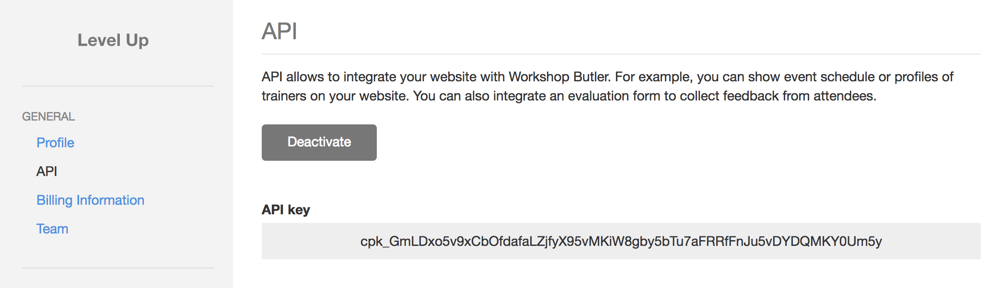

# Getting Started

There are several tools for developers to get the most of out Workshop Butler.

* [Workshop Butler API](/api) - REST API
* [Workshop Butler JS Widgets](widgets/index.md) - a widgets library which allows you to integrate your website with Workshop Butler
* [WordPress Plugin](wordpress/index.md) - integrate your WordPress website with Workshop Butler to
show workshops, trainers, and accept registrations
* [Themes](themes/index.md) - our default themes, which you can use as basis to create a custom one

## Generating an API key
To get an API key, click **Account Setting**, and then open **API** tab.

